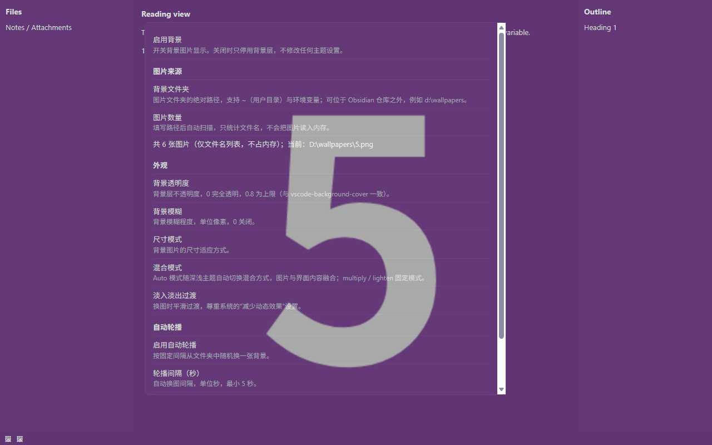
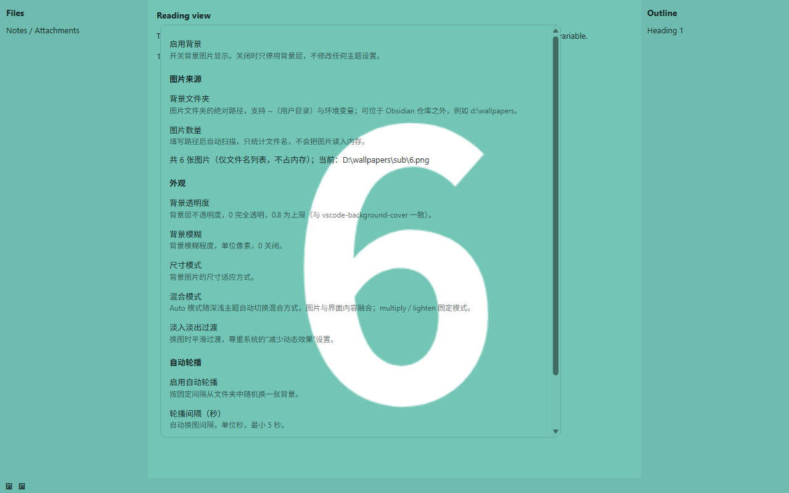

# Background Cover

A community plugin for [Obsidian](https://obsidian.md) that puts your own images behind the workspace.

**English** · [中文](README.zh.md)

The background model — opacity, blur, size modes, blend modes and the folder-based random rotation — follows [vscode-background-cover](https://github.com/AShujiao/vscode-background-cover), minus its particle effects, desktop pet and online gallery. The Obsidian-side layering approach was informed by [obsidian-dynamic-theme-background](https://github.com/sean2077/obsidian-dynamic-theme-background).

> **The point of this plugin:** your background folder can hold thousands of images (5,000+, tens of GB). Only **the one image currently on screen** is ever read into memory. The folder itself is scanned for file names only, so library size does not affect performance.





*The plugin follows Obsidian's own language setting: Chinese UI on Chinese installs, English everywhere else. The screenshots above show a Chinese install.*

## Features

**Local folder as the image source**

- Works with folders **outside** your vault (for example `d:\wallpapers`)
- Supports `~` (home directory) and `${ENV}` / `$ENV` environment variables
- Recursively scans subfolders and recognises png / jpg / jpeg / gif / bmp / webp / svg / jfif / avif

**Memory-friendly by design**

- The folder scan produces a plain array of file names; image bytes are never read in bulk
- Only the current image is read, converted to a blob URL and handed to CSS
- 5,000 wallpapers is not a problem

**No-repeat shuffle rotation**

- All images are shuffled with Fisher-Yates into a playback list. Every image appears exactly once per round, and the list is reshuffled only when it is exhausted — so "random" never lands on the same image twice in a row

**VS Code-style appearance controls**

- Opacity (0 – 0.8)
- Blur (0 – 100 px)
- Size modes: cover, contain (stretch), center (fit), repeat, and several natural-size positions
- Blend modes: `auto` (multiply on light themes, lighten on dark themes, switching instantly with the theme), `multiply`, `lighten`
- Fade transition between images, respecting the system "reduce motion" setting

**Rotation**

- Fixed-interval automatic rotation, or change the image manually at any time

**Zero conflict with themes**

- The plugin only adds its own independent background layer (all classes are prefixed `bgc-`). It does **not** modify any theme CSS variable (`--background-*`, `--text-*`, …) and does not override theme styles

## Installation

### From the community directory

Once the plugin has been reviewed and published, search for **Background Cover** in **Settings → Community plugins → Browse**.

### With BRAT (early access)

1. Install [BRAT](https://github.com/TfTHacker/obsidian42-brat).
2. In BRAT's settings, add this repository's URL.

### Manually

1. Download `main.js`, `manifest.json` and `styles.css` from the [latest release](../../releases/latest).
2. Put them in a folder named `background-cover` inside your vault:

   ```
   <Vault>/.obsidian/plugins/background-cover/
     ├── main.js
     ├── manifest.json
     └── styles.css
   ```

3. Reload Obsidian and enable **Background Cover** in **Settings → Community plugins**.

> The folder name must match the `id` in `manifest.json` (`background-cover`).
>
> **Desktop only.** The plugin sets `isDesktopOnly: true` because it reads image files through Node's `fs`, which does not exist in the mobile app.

## Usage

### Settings

Open **Settings → Background Cover**.

| Setting | Description |
| --- | --- |
| Enable background | Master switch. Turning it off only hides the background layer; no theme setting is changed. |
| Background folder | Absolute path to an image folder. Supports `~` and environment variables, and may point outside your vault. The folder is scanned as soon as you enter a path. |
| Image count | Shows how many images were found. **Rescan** re-reads the folder and reshuffles the playback list. |
| Background opacity | Opacity of the background layer, 0 – 0.8 (default 0.2). |
| Background blur | Blur radius in pixels, 0 – 100 (default 0). |
| Size mode | `cover` (fill, keeps aspect ratio) / `contain` (stretch to fill, distorts) / `center` (scale to fit, centered) / `repeat` (tile) / natural-size positions. |
| Blend mode | `auto` (follows the theme) / `multiply` / `lighten`. |
| Fade transition | Crossfade smoothly when the image changes (on by default). |
| Make theme background transparent | Makes the theme's opaque background colors transparent so the wallpaper shows its true colors. **The only feature that overrides theme colors**, off by default — see below. |
| Title bar divider | A 1 px line between the title bar and the workspace (requires the setting above). |
| Sidebar divider | A 1 px line between the sidebars and the workspace (requires the setting above). |
| Divider color | Color of both lines, default neutral gray `#808080`. |
| Divider opacity | Opacity of both lines, 0 – 1 (default 0.45). |
| Change image on startup | When on, a random image is picked on every launch. When off (default), the image from your last session is restored. |
| Enable auto rotation | Change the background at a fixed interval, off by default. |
| Rotation interval (seconds) | Interval between automatic changes, minimum 5 seconds. |
| Change background now | Immediately take the next image from the folder. |

### Commands

- **Change background** — take the next image from the playback list
- **Toggle background** — turn the background layer on or off
- **Copy diagnostics** — copy a report of your runtime (Electron / Chromium version, `color-mix` and `backdrop-filter` support, theme variables, overlay DOM structure and computed styles) to the clipboard. If you hit a problem like "the divider does not show up" or "one area still looks different", run this first and attach the output to your issue.

The diagnostics report is always in English so that it can be pasted into an issue as-is.

### Status bar

A 🖼 button in the status bar changes the image with one click.

### Playback order

"Random" is not an independent draw each time — it is a **shuffled playback list**:

- All images in the folder are shuffled into a sequence. The command, the status bar button and auto rotation all take the next entry, so **every image appears exactly once per round**. With 5,000 images you would have to click 5,000 times to see a repeat.
- The list is reshuffled when it is exhausted, when the folder path changes, or when you press **Rescan**.
- **Rescan** only reshuffles and refreshes the count; the image currently on screen does not change. The new order applies from the next change.
- Restarting Obsidian restores the image you were last showing and reshuffles. If the next entry happens to be that same image, the plugin skips to the one after it.
- With **Change image on startup** enabled, a fresh image is drawn from the new list on every launch instead of restoring the previous one.

> If your folder genuinely contains only 2–3 images, "no repeats within a round" will feel like cycling between them — that is a property of the library, not the plugin.

## Permissions and privacy

This section describes exactly what the plugin accesses and why. It is required disclosure, not marketing.

- **No network access at all.** The plugin makes no HTTP requests, downloads nothing, and has no online gallery.
- **No telemetry, no analytics, no accounts.** Nothing about you or your vault ever leaves your machine.
- **Reads image files from a folder you choose, which may be outside your vault.** This is the entire point of the plugin: your wallpaper collection usually lives somewhere like `d:\wallpapers`, not inside the vault. The plugin reads that folder's file names, then reads a single image file when it is displayed. It never writes to that folder, never deletes anything, and never scans folders you did not configure.
- **You can point it at a folder inside the vault instead** if you prefer to keep everything in one place.
- **Only file names and the one currently displayed image are held in memory.** Replaced images have their blob URL revoked immediately.
- The one exception to "read-only" is the folder path itself, which is stored in the plugin's own `data.json` inside your vault, like any other plugin setting.
- **No remote code.** Nothing is fetched and evaluated at runtime; updates only arrive through normal plugin releases.

## Compatibility with themes

By default the plugin **only adds a background**. It does not touch any theme variable — the single exception is the optional **Make theme background transparent**, which is off by default.

The background is an independent `position: fixed` full-screen layer composited over the workspace content with `mix-blend-mode` (the same default effect as vscode-background-cover). Because it is an overlay, the theme's own opaque background colors do not hide the image, so there is no need to rewrite variables such as `--background-primary`. That is the fundamental difference between this plugin and background plugins that rewrite theme variables.

One trade-off you should know about: the layer uses **`z-index: 20`**, deliberately in the middle — above the workspace and the window background bars (Obsidian's `--layer-cover 5` / `--layer-sidedock 10` / `--layer-status-bar 15`) and below floating panels (`--layer-modal 50` / `--layer-notice 60` / `--layer-menu 65` / `--layer-tooltip 70`). Menus, the command palette, notices and hover previews are therefore never tinted by the wallpaper and always look exactly like the theme. If you want the wallpaper to cover those panels too (not recommended — the blend mode will tint them), raise the `z-index` of `.bgc-layer` in `styles.css`.

One exception is worth calling out: with **frameless window mode** (`is-hidden-frameless`, common on Windows and Linux), Obsidian itself puts the title bar at `--layer-popover` (30), above the background layer. The result is that the top strip never shows the wallpaper, only the base color, as if the title bar had an extra filter. When **Make theme background transparent** is on, the plugin pushes `.titlebar` down to `--layer-status-bar` (15) in that mode so it falls below the background layer — it is just a transparent drag area, and the window buttons remain above the sidebar.

> Requires Obsidian **1.13.0** or later (dynamic styling uses the official `setCssProps` API).

## Making the theme background transparent

Some themes paint the workspace, sidebars and title bar with **opaque** background colors (Royal Velvet, for example, uses a palette of `--layer-0` … `--layer-4` across the whole UI). Those colors take part in the `mix-blend-mode` computation and pull the wallpaper toward the theme palette: the image looks gray or purple, and its dark areas get lifted. It looks like the theme is applying a filter to your background.

> Measured conclusion: this is usually not an actual filter or mask layer in the theme (there is no `filter`, `backdrop-filter` or full-screen overlay to be found in Royal Velvet). It is simply the normal result of a blend mode meeting an opaque base color.

Turn on **Settings → Background Cover → Theme integration → Make theme background transparent** to make those surfaces transparent so the wallpaper shows its true colors.

- **This is the only feature that overrides theme background colors, and it is off by default.** While it is off, the plugin still touches no theme variable at all.
- **It only affects the workspace** — menus, notices and hover previews are untouched. The variable overrides are scoped to `.workspace` (custom properties inherit downward), while Obsidian's modals live under `body`, siblings of `.app-container` and outside `.workspace`, so they are not affected. **Do not move these variables back to `body` or `.theme-*`**: once `--background-primary` becomes transparent globally, the settings window, command palette and menus all go transparent with it.
- **The note title row** (`.view-header`, the strip showing the current file name) is handled too. Core sets its background through `--file-header-background` / `--file-header-background-focused`, which are also resolved at the root and derive from `--background-primary`; what is more, its "active leaf + focused window" rule uses four classes (`(0,4,0)`) and beats an ordinary element-level override, so the plugin blanks the variable instead. **A useful diagnostic trick:** if an area only looks different while focus is in the note body and returns to normal the moment you click a sidebar or open a separate settings window, you are looking at a focus/active-state rule with higher specificity.
- **Restoring the divider lines.** Themes often set `--background-modifier-border` (which `--divider-color` defaults to) to `transparent`, leaving the UI with no dividers at all. With this option on, the plugin draws a 1 px line **between the top (tab bar / title bar) and the workspace**, and colors the sidebars' `.workspace-leaf-resize-handle` so **the sidebars get their divider back** as well. Both lines have their own switches, and the color and opacity are configurable. Only that handle is colored; no other divider in the workspace is touched.
- With this on, the workspace base color becomes pure black (dark themes) or pure white (light themes). This is not gratuitous: the wallpaper is composited with a blend mode, and a light base color makes `lighten` lift the entire image, including its dark areas, into a washed-out gray (measured: dark green foreground became pale gray-green). Pinning it to a blend-neutral color is what keeps the wallpaper true to itself. Because it is scoped to the workspace, modals and menus keep their own opaque backgrounds and are unaffected.
- The plugin also handles the opaque overlay of the Bases view, plus the **status bar and title bar** — two window background bars that sit outside `.workspace` and need separate treatment, otherwise the wallpaper shows color banding across them. If you do not want them transparent, delete the corresponding rules in `styles.css`.

## How it works

- **Layer structure.** A full-screen root container `.bgc-layer` (carrying `mix-blend-mode` and blur, whose properties stay **completely constant**) plus two image children `.bgc-layer-image` that crossfade by alternating `opacity`.
- **Why the blend mode sits on a parent that never animates.** An element with `mix-blend-mode` or `filter` is promoted to its own compositing layer while an `opacity` animation runs, and the blend mode degrades to `normal` — the whole screen flashes brighter and covers the UI at the moment of the switch. vscode-background-cover's A6 fix records this trap; this plugin split "blend mode + blur" and "crossfade" onto different elements accordingly.
- **No deferred cleanup when switching.** The inactive child is already invisible at `opacity: 0`, and its `background-image` is kept until it is overwritten. An earlier version cleared the "old layer" with a 400 ms timer, which — when you clicked quickly — also wiped the image that had just become active, making the background disappear entirely. Fixed, and the plugin now uses no timers for this at all.
- **Local images go through a blob URL, not a base64 data URL.** This one matters. The file is read and turned into a `blob:` URL (about 50 characters) written into the image layer's `--bgc-image` variable. **Do not switch this to `data:...;base64,...`**: that requires putting the whole image into an inline CSS declaration, and browsers impose a length limit on a single CSS declaration value. An over-long value is **silently discarded** — no error anywhere — after which `background-image: var(--bgc-image, none)` resolves to `none` and the background vanishes. Measured in Chromium: a 2 MB value survives intact, a 4 MB value makes `getPropertyValue()` return an empty string. A high-resolution wallpaper's base64 is routinely several to tens of MB, so the data URL approach manifests as "most images do nothing when clicked, and occasionally a small one works". A blob URL has no length limit and skips base64's 33% overhead.
- **Only one image is in memory at a time.** A replaced blob URL is revoked immediately, and everything is released when the layer unmounts, so repeated switching does not accumulate a leak.
- **Variable values are always valid CSS tokens.** `--bgc-*` only ever receives legal tokens (`none`, `cover`, `blur(4px)`, …) and never nests `var()`. A `var()` fallback only applies while the variable is **undefined**; once a variable is defined to an invalid token, the whole declaration — `mix-blend-mode` included — is dropped. That is the usual root cause of "the background is there but the blend mode stopped working". Blend mode and transitions are therefore expressed purely as CSS classes, not variables.
- **The `auto` blend mode is pure CSS.** `body.theme-light` / `body.theme-dark` select multiply / lighten, so switching themes applies instantly with no JS theme listener.
- **Randomisation** is a shuffled playlist (Fisher-Yates): every image appears once per round, and the list is reshuffled only when exhausted. Manual switching and auto rotation share the same list.
- **The settings page always matches what is on screen.** The background layer records the image it is actually displaying (`getCurrentPath()`) and the settings page reads that real state rather than keeping a second copy. Each switch also carries a request sequence number, so only the last read that was started is applied and out-of-order async reads cannot desynchronise the display.

> **Very large images:** if your folder contains a few extremely high-resolution images (a panorama can easily exceed 8000×5000), decoding will be noticeably slower and memory will spike briefly when one comes up. That is the cost of the image itself — the plugin still holds only that one. **Change background now** skips past it.

## Development

```bash
npm install      # install dependencies
npm run dev      # watch mode, compiles into output/
npm run build    # production build (tsc type check + esbuild bundle) into output/
npm run lint     # ESLint
```

Build artifacts go to `output/`, which contains `main.js`, `manifest.json` and `styles.css` — a folder that can be dropped straight into a vault or attached to a GitHub release.

Source layout:

```
src/
  main.ts         # plugin lifecycle, commands, status bar, folder scan cache
  background.ts   # background layer: dual image layers, blob URLs, blend classes
  settings.ts     # settings interface, defaults and the settings tab
  i18n.ts         # UI strings (English + Chinese) and language selection
  css.ts          # size-mode → CSS mapping, colour helpers
  folder.ts       # path expansion, recursive scan, shuffle playlist
  diagnostics.ts  # the "Copy diagnostics" report
```

See [CONTRIBUTING.md](CONTRIBUTING.md) for the constraints that apply to changes, the UI text rules and the release process.

**There is no automated test suite in this repository.** Changes are verified locally by loading the built `main.js` in a headless browser against a harness that recreates Obsidian's DOM; that harness depends on a local wallpaper folder, so it is not shipped here. If you change rendering behaviour — blend modes, z-index, the theme-transparency feature — please say in your pull request how you verified it and on which theme.

## Releasing

1. Bump the version with `npm version <x.y.z>`. The `version` script updates `manifest.json` and `versions.json`; `.npmrc` sets `tag-version-prefix=""` so the git tag is the bare version with no `v` prefix.
2. Add the entry to [CHANGELOG.md](CHANGELOG.md).
3. Push the tag. `.github/workflows/release.yml` builds the plugin, attests build provenance, and publishes a release with `main.js`, `manifest.json` and `styles.css` attached. The workflow refuses to publish if the tag does not match the `version` in `manifest.json`.
4. Obsidian installs by looking up the release whose tag equals the `version` in your manifest, so the tag must match exactly and the release must be **published**, not a draft.

## Submitting to the community directory

The submission process is self-service at [community.obsidian.md](https://community.obsidian.md) — there is no longer a pull request to `obsidian-releases`.

1. Create a GitHub release whose tag matches `manifest.json`'s `version`, with `main.js`, `manifest.json` and (optionally) `styles.css` attached.
2. Sign in at [community.obsidian.md](https://community.obsidian.md) with your Obsidian account and connect your GitHub account.
3. Add the plugin by repository URL, review and accept the [Developer policies](https://docs.obsidian.md/community-directory/developer-policies), and submit.
4. The directory reads `manifest.json` from the HEAD of the default branch, so make sure it is committed. The `id` must be unique across all published plugins and **must not contain `obsidian`**.
5. Fix anything the automated review reports, then publish a new release with an incremented version.

See [Submit your plugin](https://docs.obsidian.md/plugins/releasing/submit-plugin) and the [submission requirements](https://docs.obsidian.md/community-directory/submission-requirements-for-plugins) for the authoritative details.

## Credits

The design and implementation of this plugin were informed by the following open-source projects:

- **[vscode-background-cover](https://github.com/AShujiao/vscode-background-cover)** (MIT, © 2021 ashujiao) — the background parameter model (opacity / blur / size mode / blend mode / transition), folder-based random rotation, and the "load only the current image" memory strategy. Its A6 note in `src/loaderFragments.ts` about `mix-blend-mode` / `filter` degrading when an element is promoted during an `opacity` animation is what this plugin's layer structure is built around.
- **[obsidian-dynamic-theme-background](https://github.com/sean2077/obsidian-dynamic-theme-background)** (MIT, © 2025 Sean2077) — the approach to implementing the background as an independent overlay layer in Obsidian, the multiply-on-light / lighten-on-dark blend semantics, and the use of a blur filter.
- **[obsidian-sample-plugin](https://github.com/obsidianmd/obsidian-sample-plugin)** — project scaffold (TypeScript + esbuild build configuration, manifest conventions).
- **[esbuild](https://esbuild.github.io/)** — the bundler.

Both upstream projects are MIT-licensed, so the ideas and parameter semantics borrowed here are used within their terms. This project is an independent implementation: it contains no copied source text from either project, and the attribution above is given because it is the right thing to do, not because a licence compels it.

## AI assistance disclosure

The code and documentation of this project were produced with AI assistance:

- **ByteDance Doubao (豆包) LLM** — initial requirements analysis, architecture, first implementation, documentation and build configuration.
- **DeepSeek (`deepseek-flash`, via the DeepSeek Harness coding agent)** — fixed the "background disappears after rapid switching" and "settings page shows a different name than the actual background" defects; found and fixed the deeper root cause (writing images into inline CSS as data URLs exceeds the browser's per-declaration length limit and is silently discarded — measured between 2 and 4 MB — now using blob URLs); restructured the background layers to separate blend mode/blur from the crossfade; completed the blend-mode and opacity failure handling; rewrote the styles, build output and this documentation; verified each change by loading the real build artifact in a headless browser against a local Obsidian DOM harness; and localised the UI, added the contributor and issue-template files, and prepared the project for the community directory.

All AI-generated content was reviewed by a human and passes TypeScript type checking, ESLint and a render verification of the built artifact. If you have concerns about AI-assisted development, the source and commit history are open to inspection.

## License

Released under the [MIT License](LICENSE).

---

**Disclaimer**: This project is an independent community plugin and is not affiliated with or endorsed by Obsidian.
